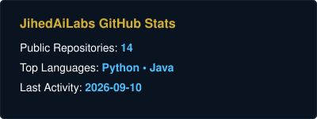
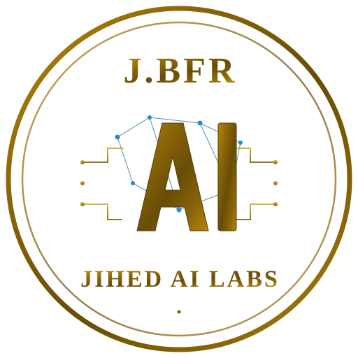

<!-- GENERATED FILE — edit templates/README.fr.j2 instead -->
# Jihed Ben Arfa

Connaissance d'ingénierie de production, laboratoires exécutables et bibliothèques Spring réutilisables pour architectes Java : systèmes distribués, sécurité Keycloak, orchestration BPMN, provisioning télécom et IA d'entreprise.

[English](README.md) · **Français**

  

---

## Point de départ

| Si vous êtes un(e)... | Commencez par... |
| --- | --- |
| Architecte Java/Spring | [engineering-library](https://github.com/jihedbfr-art/engineering-library) |
| Ingénieur Sécurité / IAM | [keycloak-spi-workbench](https://github.com/jihedbfr-art/keycloak-spi-workbench) + [spring-keycloak-toolkit](https://github.com/jihedbfr-art/spring-keycloak-toolkit) |
| Ingénieur IA d'entreprise | [ai-skills](https://github.com/jihedbfr-art/ai-skills) |
| Ingénieur Télécom / BSS | [bpmn-provisioning-patterns](https://github.com/jihedbfr-art/bpmn-provisioning-patterns) |
| Agent de codage | `llms.txt` / `skills-index.json` |

## Projets phares
- 📚 **[engineering-library](https://github.com/jihedbfr-art/engineering-library)** — Monorepo Java 17 / Spring Boot 3 de qualité production avec plus de 90 implémentations de référence (`nano` à `macro`), 13 domaines de connaissances, ADRs, et analyses post-mortem.
- 🔀 **[bpmn-provisioning-patterns](https://github.com/jihedbfr-art/bpmn-provisioning-patterns)** — Modélisation de provisioning télécom avec Camunda + Spring Boot + Kafka Sagas, portabilité des numéros multi-opérateurs avec SLA, et compensation par lots basée sur des seuils.
- 🛠️ **[keycloak-spi-workbench](https://github.com/jihedbfr-art/keycloak-spi-workbench)** — Extensions Keycloak SPI concrètes (Authentificateurs personnalisés, Écouteurs d'événements, Fédération) construites correctement avec une couverture complète de tests d'intégration.
- 🔐 **[spring-keycloak-toolkit](https://github.com/jihedbfr-art/spring-keycloak-toolkit)** — Bibliothèque d'auto-configuration Spring Boot d'entreprise pour les serveurs de ressources Keycloak OAuth2/OIDC, résolvant le mapping de rôles et les détails de problèmes RFC 7807.
- 🤖 **[ai-skills](https://github.com/jihedbfr-art/ai-skills)** — Base de connaissances pragmatique en ingénierie IA (Économie des LLM, RAG Hybride, Orchestration Multi-Agents, Protocole MCP, Spring AI & Guardrails) propulsée par *JihedAiLabs*.
- 🛡️ **[cyber-skills](https://github.com/jihedbfr-art/cyber-skills)** — Une bibliothèque de compétences de sécurité sur 26 domaines — chacune étant un SKILL.md prêt pour les agents qui sert également d'aide-mémoire pour les humains. Bilingue EN/FR.

### Activité

| Dépôt | Langage | Dernier push |
| --- | --- | --- |

| [engineering-library](https://github.com/jihedbfr-art/engineering-library) | Java | 2026-08-28 |

| [bpmn-provisioning-patterns](https://github.com/jihedbfr-art/bpmn-provisioning-patterns) | Java | 2026-08-25 |

| [keycloak-spi-workbench](https://github.com/jihedbfr-art/keycloak-spi-workbench) | Java | 2026-08-28 |

| [spring-keycloak-toolkit](https://github.com/jihedbfr-art/spring-keycloak-toolkit) | Java | 2026-08-25 |

| [ai-skills](https://github.com/jihedbfr-art/ai-skills) | Python | 2026-08-25 |

| [cyber-skills](https://github.com/jihedbfr-art/cyber-skills) | Python | 2026-08-25 |

## Parcours d'apprentissage
1. **[De Spring Boot à Spring Cloud](https://github.com/jihedbfr-art/engineering-library/tree/main/knowledge)** : Maîtriser l'architecture microservices, de la conception à la production.
2. **[Sécurisation par Keycloak](https://github.com/jihedbfr-art/keycloak-spi-workbench)** : Comprendre et étendre Keycloak (SPI), intégrer OAuth2/OIDC avec Spring.
3. **[Orchestration & Résilience (BPMN)](https://github.com/jihedbfr-art/bpmn-provisioning-patterns)** : Gérer les transactions distribuées, patterns de saga et la résilience système.
4. **[IA d'entreprise Appliquée](https://github.com/jihedbfr-art/ai-skills)** : Intégrer l'IA générative dans des workflows de production existants (RAG, Agents, Spring AI).
5. **[Standardisation et CI/CD](https://github.com/jihedbfr-art/jihedbfr-art)** : Lint documentaire, vérifications i18n et garde-fous de fraîcheur appliqués à chaque push — le même patron de gouvernance répliqué sur tous les repos ci-dessus.

## Principes d'ingénierie
L'ingénierie n'est pas qu'une question de code, c'est avant tout la maîtrise de la complexité. Je crois fermement à la simplicité par le design (clean architecture), à la sécurité par défaut, et à la validation par l'exécution plutôt que par la théorie. Un système distribué doit être conçu pour échouer de manière prévisible, avec des limites claires et une observabilité totale. Mon approche privilégie la fiabilité de production, l'automatisation implacable, et le partage transparent de connaissances éprouvées sur le terrain.

## Contribution / Contact
- **LinkedIn** : [Jihed Ben Arfa](https://www.linkedin.com/in/jihedbenarfa/)
- **GitHub Discussions/Issues** : N'hésitez pas à ouvrir des *issues* ou des *discussions* sur les dépôts respectifs.

*(Les contacts directs se font exclusivement via LinkedIn ou par message sur GitHub. Aucun support ni discussion via email n'est accepté.)*

---

  <picture>
    <source media="(prefers-color-scheme: dark)" srcset="assets/brand/jihedailabs-logo-dark.svg">
    <source media="(prefers-color-scheme: light)" srcset="assets/brand/jihedailabs-logo-light.svg">
    
  </picture>
   
  Un projet <a href="https://github.com/jihedbfr-art"><b>JihedAiLabs</b></a>
   
  <small>Dernière mise à jour : 2026-08-29 05:11:16 UTC</small>

